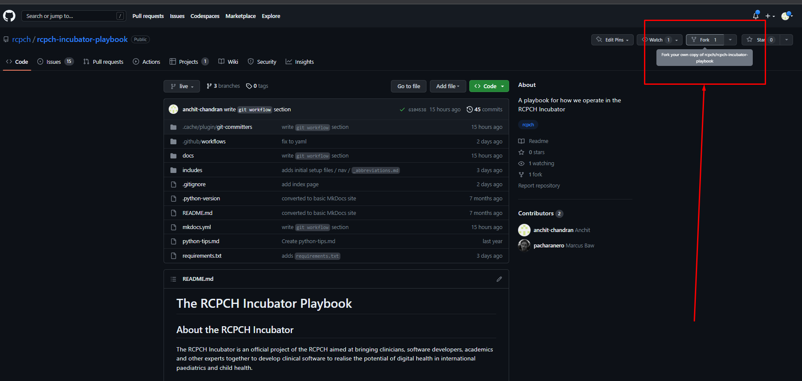
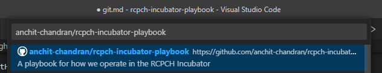
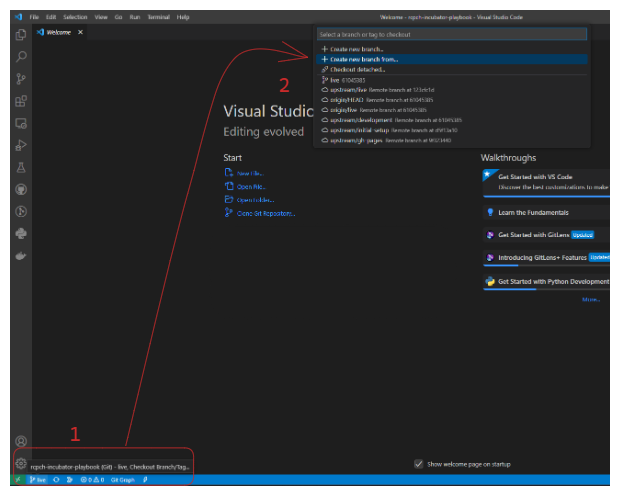
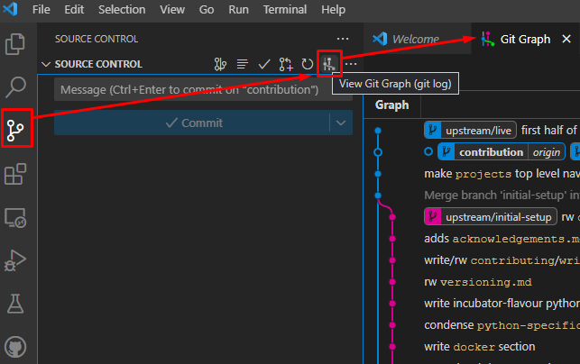
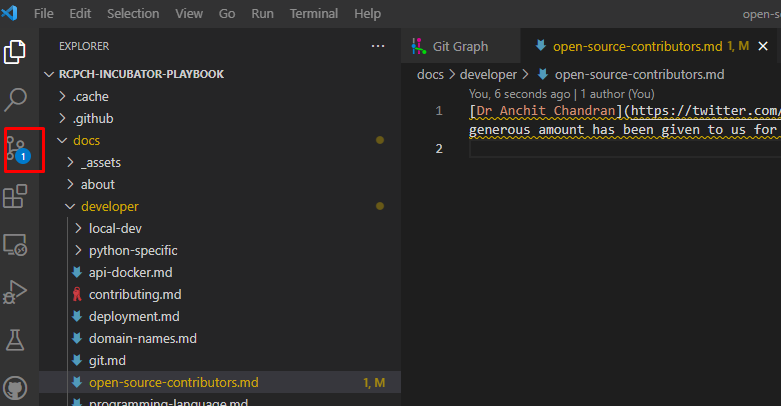
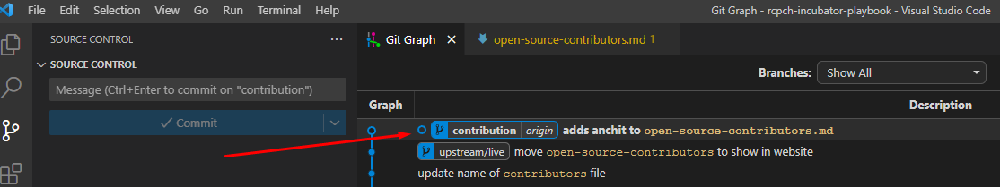
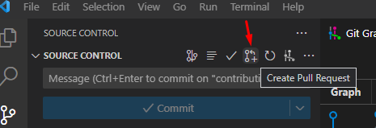

## What is Git?

Git is a **distributed version control** system that allows developers to collaborate on projects, track changes to source code, and manage different versions of code.

It was created by Linus Torvalds in 2005 for the development of the Linux kernel, but it has since become widely adopted by developers across various industries.

Git uses a **decentralized** model, which means that each developer has a copy of the entire codebase on their local machine, and changes are tracked and managed through a series of commits. This allows for easier collaboration, as multiple developers can work on the same codebase at the same time without interfering with each other's changes.

Git also allows for **branching** and **merging** of code, which is useful for managing different versions of a project, or for working on different features or bug fixes in parallel. It also has a robust set of tools for resolving conflicts that may arise when merging code changes from different branches or developers.

Overall, Git is a powerful tool for managing software development projects, and it has become an essential part of modern software development workflows.

## What is GitHub?

GitHub is a web-based platform that provides hosting for Git repositories. It was launched in 2008 and quickly became one of the most popular platforms for hosting open source projects, as well as private repositories for individuals and organizations.

GitHub provides a range of features which help Incubator developers collaborate on projects and manage code changes. In addition to hosting Git repositories, it offers tools for code review, issue tracking, and project management. It also provides a platform for developers to showcase their work, discover new projects, and contribute to existing ones.

## Why do we use Git?

The RCPCH Incubator uses Git for 3 main reasons:

1. **Version Control** allows us to track changes to code over time, and manage different versions of their codebase.

2. **Collaboration**: Git enables our team to work together on the same codebase at the same time, without interfering with each other's changes.

3. **Open Source Community**: Git is widely used by the open source community, of which the RCPCH Incubator team supports. which means that developers can easily find and contribute to open source projects hosted on platforms like GitHub. This can be a great way to learn new skills, collaborate with other developers, and showcase their work.

## Overview of GitHub Workflow

This is an overview of our Git Workflow. Further down, there is a guided walkthrough.

### TL/DR Git Workflow

If you're used to Git, the TL/DR of our Workflow is:

1. There are **3 primary branches**: `live`, `staging`, `development`
2. To contribute, you should make **feature** branches off `development` and make **PR**s back to `development`.
3. At regular intervals, merges will occur in order: `development -> staging -> live`

We also use GitHub Projects for product management and productivity.

### The Git Workflow

Our Git Workflow centres around ensuring our live code never breaks through bugs due to various security checks in the code chain.

There are 3 primary, central branches:

1. `live`
2. `staging`
3. `development`

If you wish to contribute to any project, you should first **fork** then **clone** the repository (so you have a copy of the code on your local machine).

Then, create a **branch** off the `development` branch - this will be your **"feature branch"** where you can write your code.

Whilst working inside your feature branch, you should ensure your commits are as atomic as possible with succinct commit messages.

Finally, when your new feature is ready, you make a **Pull Request** to merge your feature branch into `development`.

!!!info "ONLY MAKE PR'S TO `development`"
    Ensure your **PR** is *not* made to `staging` or `live`.

If your code passes review, your feature will be merged into `development`. Then, at regular intervals,  `development` will be merged into `staging`, and tested to ensure no errors. Finally, if everything works, `staging` will be merged into `live`. Each step of this cascade must pass rigorous testing and ensures that live clinical products and services do not fail. In a related fashion, we also keep our `development` as close to `live` as possible.

If you're looking for ideas, you can have a look at the **issues** for the project. We use Github Projects to track our progress, manage priorities, and enable agile development.

## Downloading VS Code Git Extensions

Before the guided walkthrough, you should download the following Git extensions for VS Code:

- [Git Graph](https://marketplace.visualstudio.com/items?itemName=mhutchie.git-graph)
- [GitLens - Git supercharged](https://marketplace.visualstudio.com/items?itemName=eamodio.gitlens)

[GitHub Desktop](https://desktop.github.com/) is another useful tool to help with the Git workflow but not necessary!

Ultimately, Git works through writing commands in a terminal such as `git add .` or `git commit -m "my first commit!"`.

However, with the VS Code extensions listed above, you can get away with using the Graphical User Interface (GUI) for almost everything you'll want to do. Under the hood, every click in these GUIs runs Git commands, which you can see in the `OUTPUT` of the VS Code terminal.

These extensions:

1. Simplify the Git process, allowing you to understand what's happening through a clear visual representation.
2. Supercharge your productivity, by having a quick and easy processes to run Git commands.
3. Reduce friction in development, through saving you countless hours and headaches related to problems like branch issues / detached HEADs etc.

## VS Code Git Example Walkthrough

This walkthrough with guide you through the steps of our usual Git Workflow, all without having to type any Git commands yourself!

You should already be familiar with how Git works. [Codecademy](https://www.codecademy.com/learn/learn-git) have a great interactive tutorial, or you can use one of the countless free ones online. Also, create a GitHub account if you don't already have one.

Though open-source allows everyone to **see** your code, it does not allow everyone to **change** your code.

However, to make contributions, you *can* make your own copy of the entire codebase, make changes, and request the original developers to *pull* your changes into their code.

### Making your first Open-Source Contribution to the RCPCH Incubator!

The workflow has 5 steps:

1. Fork the repository (repo) (onto your own GitHub)
2. Clone the repo (onto your own computer)
3. Create a branch from `development`
4. Add your code, pushing your succinct, atomic commits to your own fork
5. Submit a PR to `development`

We will go through each step using a worked example. By the end, you will have made your first ever open-source healthcare technology contribution!

### Step 1) Forking the repo

To start, we will **fork** this website's repo. This means we will make an online copy of the website's repo in our own GitHub account.

Go the the repo (https://github.com/rcpch/rcpch-incubator-playbook) and click on '`Fork`' at the top-right:

Click on the green "Create fork" button.

You should now see your own copy of the `rcpch-incubator-playbook`.

### Step 2) Clone the repo

Though we have an online copy of the repo, we need it on our actual machines to edit with VS Code. We do this by **cloning** the repo.

Open VS Code.

Assuming you've set up all the Git extensions in VS Code, open the Command Palette (`Ctrl/Cmd+Shift+P`) and type `>clone` (the `>` should automatically be inserted already), and click on `Git: Clone` -> `Clone from GitHub`.

Click on your fork. It should already be near the top, but if it isn't, the default name is `YOUR-USERNAME/rcpch-incubator-playbook`.

VS Code should automatically open the project.

### Step 3) Create a branch from `development`

Your '*feature*' branch should be based on the most recent codebase, which will be `development`.

In the bottom left, click on the branch button (the default branch will be `live`).

Select `Create a new branch from...` and select `development` (it might be called `upsteam/development`).

Name your branch whatever you wish e.g. `contribution`. The name should relate to whatever you're working on.

The bottom left branch button should now show the name of you branch.

Next, click on the 'Source Control' icon on the left. Click 'Publish Branch' to publish your branch to `origin` (which publishes it to your own fork of the repo).

Then click on the 'View Git Graph' icon (above the commit message textbox), which will open a visual representation of all branches.

### Step 4) Adding your code and making a commit

We're finally ready to make code changes.

To keep it simple, you'll just add your name to the `open-source-contributors.md` file.

Open up `open-source-contributors.md` (in `docs->developer->open-source-contributors.md`).

On a single line, add:

1. Your name
2. A link to your social media, if you wish.
3. Your favourite quote

Save the file.

You should see a "`1`" pop up next to the 'SOURCE CONTROL' icon on the left:

Navigating back to 'SOURCE CONTROL', we can see that we have 1 change to be committed. This is where the magic happens.

First, click on '`Stage All Changes`', which will stage your edit of `open-source-contributors.md`, ready to be committed.

Once staged, write your commit message in the textbox.

!!!info "Tips on writing commit messages"

    Ideally, commit messages should be concise (less than around 50 characters), descriptive, and written in the present-tense, starting with a verb.

    Imagine every message starts with "This commit..." followed by your message. For example: 

    *This commit...* `adds name to open-source-contributors.md`
    
    The `adds name to open-source-contributors.md` would be the actual commit message.

You can write your own message, following these guidelines.

Once written, click 'Commit' and 'Sync Changes' to push your local commit up to your online repo fork. If you go back to the Git Graph, you can see your commit added:

!!!warning "GPG Verification"
    Developers making significant contributions to the RCPCH Incubator Projects will require GPG signing on commits for verification.

### Step 5) Making a Pull Request

Now we've made our awesome feature, we will request it to be merged into the original codebase, through a **pull request**.

Again in 'SOURCE CONTROL', click on the 'Create Pull Request' icon:

## Tips and tricks

