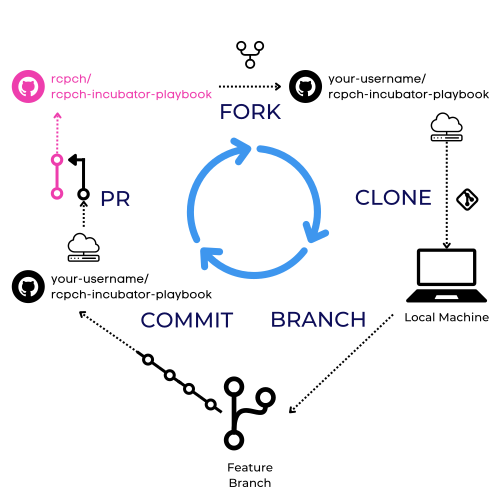

## What is Git?

Git is a **distributed version control** system that allows developers to collaborate on projects, track changes to source code, and manage different versions of code.

Linus Torvalds created Git in 2005 to develop the Linux kernel, but developers across various industries have since adopted it widely.

Git uses a **decentralized** model, meaning each developer has a copy of the entire codebase on their local machine, and changes are tracked and managed through a series of commits. This allows for easier collaboration, as multiple developers can work on the same codebase simultaneously without interfering with each other's changes.

Git also allows for **branching** and **merging** of code, which helps manage different project versions and work on additional features or bug fixes in parallel. It also has a robust set of tools for resolving conflicts that may arise when merging code changes from different branches or developers.

Overall, Git is a powerful tool for managing software development projects, and it has become an essential part of modern software development workflows.

## What is GitHub?

GitHub is a web-based platform that provides hosting for Git repositories. It was launched in 2008 and quickly became one of the most popular platforms for hosting open-source projects and private repositories for individuals and organizations.

GitHub provides a range of features which help Incubator developers collaborate on projects and manage code changes. In addition to hosting Git repositories, it offers tools for code review, issue tracking, and project management. It also provides a platform for developers to showcase their work, discover new projects, and contribute to existing ones.

## Why do we use Git?

The RCPCH Incubator uses Git for three main reasons:

1. **Version Control** allows us to track changes to code over time and manage different versions of their codebase.

2. **Collaboration**: Git enables our team to work together on the same codebase at the same time without interfering with each other's changes.

3. **Open Source Community**: The open-source community, which the RCPCH Incubator team supports, widely uses Git, as it has become an industry-standard.

## Overview of GitHub Workflow

This is an overview of our Git Workflow. In the next section, there is a guided walkthrough for those who are unfamiliar with Git or need a refresher.

### TL/DR Git Workflow

If you're used to Git, the TL/DR of our Workflow is:

1. There are **3 primary branches**: `live`, `staging`, `development`
2. To contribute, you should make **feature** branches off `development` and make **PR**s back to `development`.
3. At regular intervals, merges will occur in order: `development -> staging -> live`

We also use GitHub Projects for product management and productivity.

### Our Git Workflow

Our Git Workflow centres around ensuring our live code never breaks through bugs due to various security checks in the code chain.

There are 3 primary, central branches:

1. `live`
2. `staging`
3. `development`

If you wish to contribute to any project, you should first **fork** then **clone** the repository (so you have a copy of the code on your local machine).

Then, create a **branch** off the `development` branch - this will be your **"feature branch"** where you can write your code.

Whilst working inside your feature branch, ensure your commits are as atomic as possible with succinct commit messages.

Finally, when your new feature is ready, you make a **Pull Request** to merge your feature branch into `development`.

!!!info "ONLY MAKE PR'S TO `development`"
    Ensure your **PR** is *not* made to `staging` or `live`.

If your code passes review, we will merge your code into `development`. Then, at regular intervals,  `development` will be merged into `staging`, and tested to ensure no errors. Finally, if everything works, `staging` will be merged into `live`. Each step of this cascade must pass rigorous testing and ensures that live clinical products and services do not fail. In a related fashion, we also keep our `development` as close to `live` as possible.

If you're looking for ideas, you can have a look at the **issues** for the project. We use Github Projects to track our progress, manage priorities, and enable agile development.

## Downloading VS Code Git Extensions

Before the guided walkthrough, you should download the following Git extensions for VS Code:

- [Git Graph](https://marketplace.visualstudio.com/items?itemName=mhutchie.git-graph)
- [GitLens - Git supercharged](https://marketplace.visualstudio.com/items?itemName=eamodio.gitlens)

[GitHub Desktop](https://desktop.github.com/) is another valuable tool to help with the Git workflow!

Ultimately, Git works through writing commands in a terminal such as `git add .` or `git commit -m "my first commit!"`.

However, with the VS Code extensions listed above, you can get away with using the Graphical User Interface (GUI) for almost everything you'll want to do. Under the hood, every click in these GUIs runs Git commands, which you can see in the `OUTPUT` of the VS Code terminal.

These extensions:

1. Simplify the Git process, allowing you to understand what's happening through a clear visual representation.
2. Supercharge your productivity with a quick and easy process to run Git commands.
3. Reduce development friction by saving you countless hours and headaches related to problems like branch issues / detached HEADs etc.
