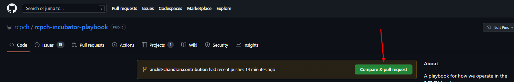
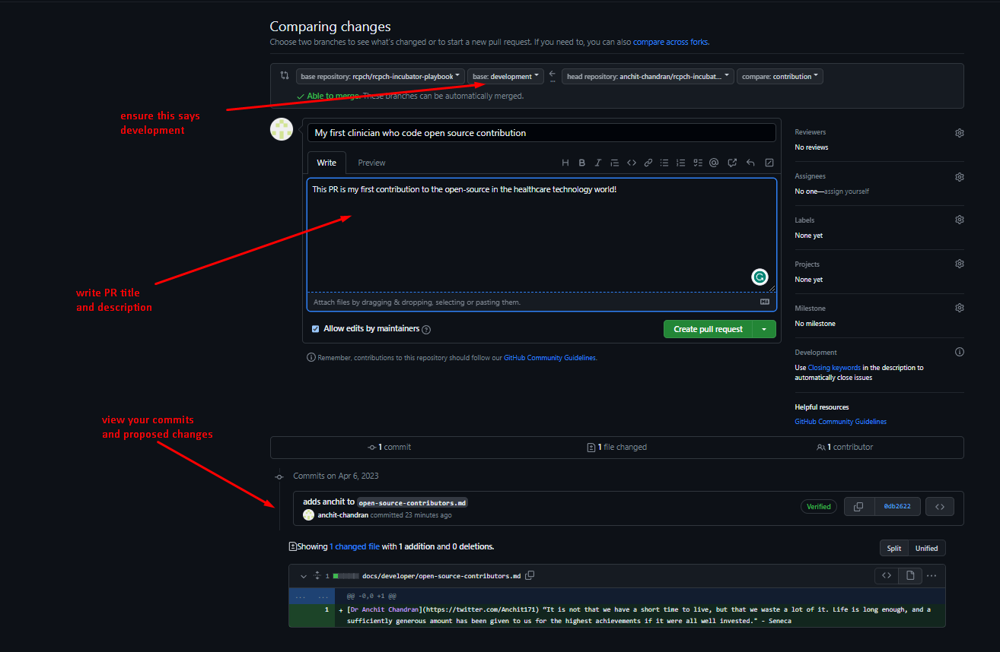

This walkthrough with guide you through the steps of our usual Git Workflow, all without having to type any Git commands yourself!

You should already be slightly familiar with how Git works from the command line. [Codecademy](https://www.codecademy.com/learn/learn-git) has a great interactive tutorial, or you can use one of the countless free ones online.

You should have created a GitHub account and installed the [VS Code Git Extensions](./overview.md#downloading-vs-code-git-extensions).

## Why are these steps necessary?

Though open-source allows everyone to **see** your code, it does not allow everyone to **change** your code.

However, to make contributions, you *can* make your copy of the entire codebase, make changes, and request the original developers to *pull* your changes into their code.

## Making your first Open-Source Contribution to the RCPCH Incubator!

The workflow has five steps:

1. Fork the repository (repo) (onto your own GitHub)
2. Clone the repo (onto your computer)
3. Create a branch from `development`
4. Add your code, pushing your succinct, atomic commits to your own fork
5. Submit a PR to `development`

We will go through each step using a worked example. You will have made your first open-source healthcare technology contribution by the end!

## Step 1) Forking the repo

To start, we will **fork** this website's repo. This means we will make an online copy of the website's repo in our GitHub account.

Go the the repo (https://github.com/rcpch/rcpch-incubator-playbook) and click on '`Fork`' at the top-right:

Click on the green "Create fork" button.

You should now see your copy of the `rcpch-incubator-playbook`.

## Step 2) Clone the repo

Though we have an online copy of the repo, we need it on our actual machines to edit with VS Code. We do this by **cloning** the repo.

Open VS Code.

Assuming you've set up all the Git extensions in VS Code, open the Command Palette (`Ctrl/Cmd+Shift+P`) and type `>clone` (the `>` should automatically be inserted already), and click on `Git: Clone` -> `Clone from GitHub`.

Click on your fork. It should already be near the top, but if it isn't, the default name is `YOUR-USERNAME/rcpch-incubator-playbook`.

VS Code should automatically open the project.

## Step 3) Create a branch from `development`

Your '*feature*' branch should be based on the most recent codebase, which will be `development`.

In the bottom left, click the branch button (the default branch will be `live`).

Select `Create a new branch from...` and select `development` (it might be called `upsteam/development`).

Name your branch whatever you wish, e.g. `contribution`. The name should relate to whatever you're working on.

The bottom left branch button should now show the name of your branch.

Next, click on the 'Source Control' icon on the left. Finally, click 'Publish Branch' to publish your branch to `origin` (which publishes it to your repo fork).

Then click on the 'View Git Graph' icon (above the commit message textbox), which will open a visual representation of all branches.

## Step 4) Adding your code and making a commit

We're finally ready to make code changes.

To keep it simple, you'll just add your name to the `open-source-contributors.md` file.

Open up `open-source-contributors.md` (in `docs->developer->open-source-contributors.md`).

On a single line, add:

1. Your name
2. A link to your social media, if you wish.
3. Your favourite quote

Save the file.

You should see a "`1`" pop up next to the 'SOURCE CONTROL' icon on the left:

Navigating back to 'SOURCE CONTROL', we see that we have 1 change to commit. This is where the magic happens.

First, click on '`Stage All Changes`' which will stage your edit of `open-source-contributors.md`, ready to be committed.

Once staged, write your commit message in the textbox.

!!!info "Tips on writing commit messages"

    Ideally, commit messages should be concise (roughly less than 50 characters), descriptive, and written in the present tense, starting with a verb.

    Imagine every message starts with "This commit..." followed by your message. For example: 

    *This commit...* `adds name to open-source-contributors.md`
    
    The actual commit message would be the `adds name to open-source-contributors.md`.

You can write your message following these guidelines.

Once written, click 'Commit' and 'Sync Changes' to push your local commit up to your online repo fork. Then, if you go back to the Git Graph, you can see your commit added:

!!!warning "GPG Verification"
    Developers making significant contributions to the RCPCH Incubator Projects will require GPG signing on commits for verification.

## Step 5) Making a Pull Request

Now that we've made our excellent feature, we will request it to be merged into the original codebase through a **pull request**.

Go back to the original GitHub `rcpch-incubator-playbook` repo: https://github.com/rcpch/rcpch-incubator-playbook/tree/development.

You should see that your branch had recent pushes with an option to make a PR. Click on the green button:

You will be taken to the Pull Request creation form:

First, on this screen, ensure you are requesting to merge into **`base: development`**.

You can write your title and description to help reviewers understand the reasons for your changes and what has changed.

At the bottom, you can see your branch's commits and file changes.

Once everything looks good, click the green 'Create pull request' button, and you're done!

After it is reviewed and merged, you'll be able to see your name on [this page](./open-source-contributors.md).
